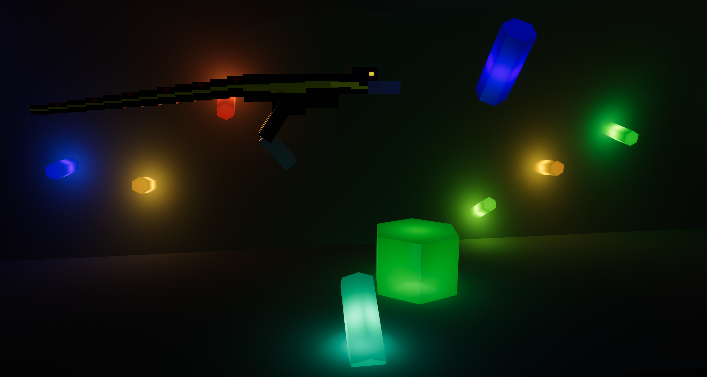
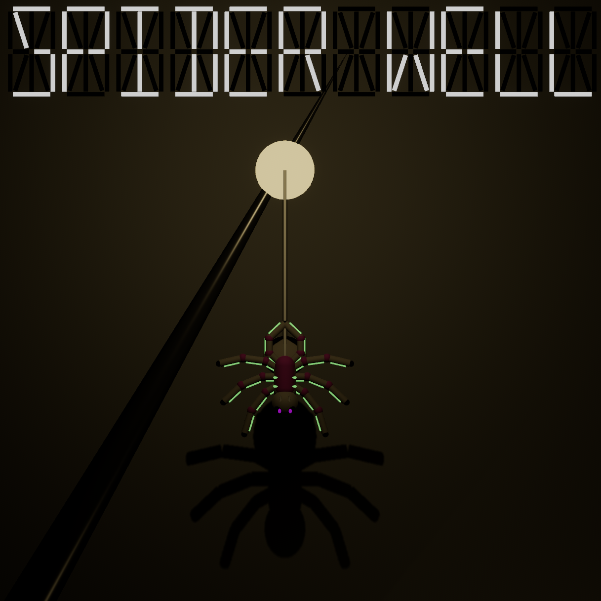

# Top-level description
This repo is just so I can distribute my Art Fight submissions, as the site isn't exactly meant for micro-games as an art-form.

All "distro" .zip files contain the executable and any additional files (mostly audio) needed to have the full experience. Unless otherwise stated, the Linux version was compiled for Arch, and the Windows version on Windows 11. I do not have a mac to test or compile, but as each game is contained within one plugin, it should not be difficult to compile your own version if you so desire. Additionally, while I may improve some things post-release, I will not update the executables until the end of art fight, as, that would be a hassle.

## Chompless and The Crystal Cavern or "Dino Run"

A runner game meant to loosely parody the offline dino runner playable in Google Chrome, there are 3 buttons and they all jump: W, Space, and Up Arrow. It's an easy enough game that scoring seemed irrelevant, but if you jump the obstacle, it makes a good noise, and if you don't, your dino is obviously harmed via a bad noise ahd a brief flickering period.

[Art Fight Page](https://artfight.net/attack/10352685.chompless-and-the-crystal-cavern-playable-game)

[Windows](https://github.com/ReallyMadHermit/art_fight/blob/c1674f463678429a297a2d6e5ae92048760c2ff0/dino_run_windows_distro.zip)

[Linux (or, arch)](https://github.com/ReallyMadHermit/art_fight/blob/c1674f463678429a297a2d6e5ae92048760c2ff0/dino_run_linux_distro.zip)

## Spider Well

I'm THRILLED with how that image came out, it's so striking, and it just, man, what a good pitch image, it's so dramatic. A pretty novel game concept about swinging and climbing with a bit of free-falling, an emphasis on shadows and light. It's called Spider Well as a Downwell reference, and there's a spider. Use WASD, or the arrow keys, or 8456 on your numpad to control your character, hold Spacebar, or 0/insert on your numpad to enter free-fall. The goal is to get to the bottom, and then back to the top, as fast as possible. My personal best is 62 seconds.